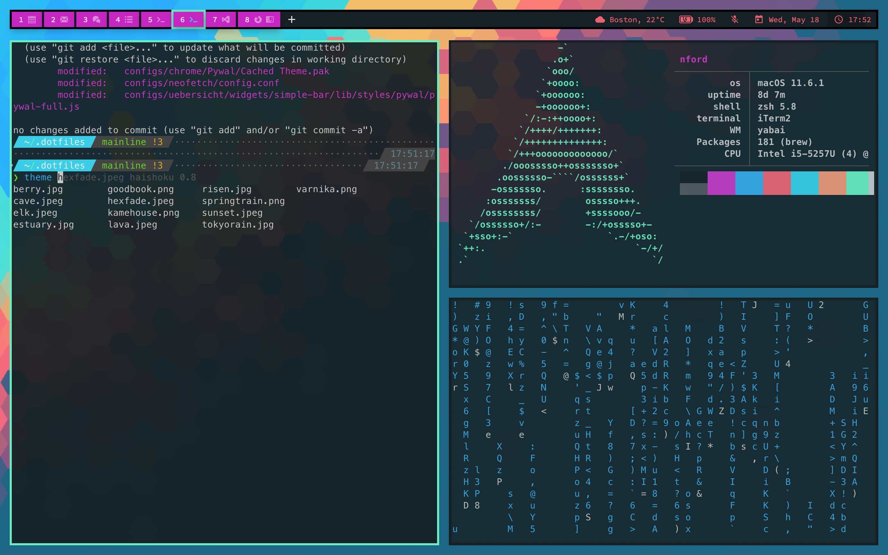
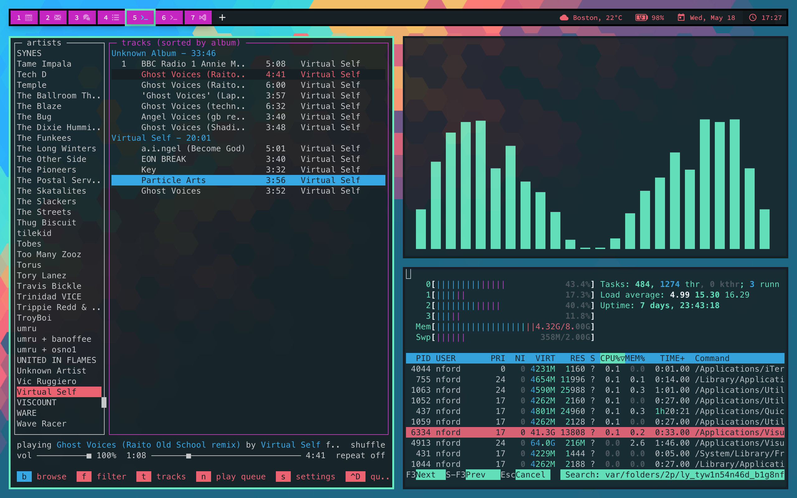
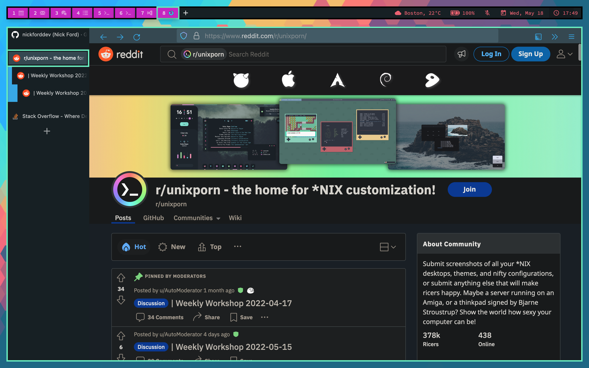

# dotfiles

[](https://opensource.org/licenses/MIT)

All my dots

## Screenshots



Color schemes are generated based on wallpaper using a wrapper around [pywal](https://github.com/dylanaraps/pywal)






## Setup

This one liner installs and sets up everything:

```bash
# macOS
sh -c "$(curl -fsSL https://raw.githubusercontent.com/nickforddev/dotfiles/mainline/install-mac.sh)"
```

Running the setup script does the following:

1. Install zsh and oh-my-zsh
1. Install homebrew & packages
1. Install nvm, node, and npm
1. Install node dependencies
1. Symlink dotfiles
1. Source `~/.zshrc`

Before symlinking the dotfiles, you will be prompted to pick which ones to install, and if there are existing dotfiles there you'll be prompted to overwrite or skip.

## Untracked configs

If a setting is device-specific or sensitive, it should be added to a `.untracked` config. For instance, if `~/.zshrc.untracked` exists, it will be automatically sourced, but not tracked by git.

TODO: JetBrains editor scheme is not dynamic