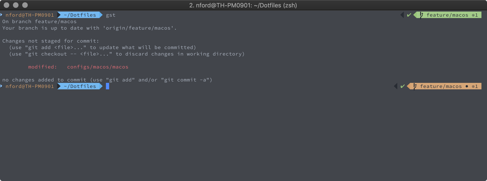
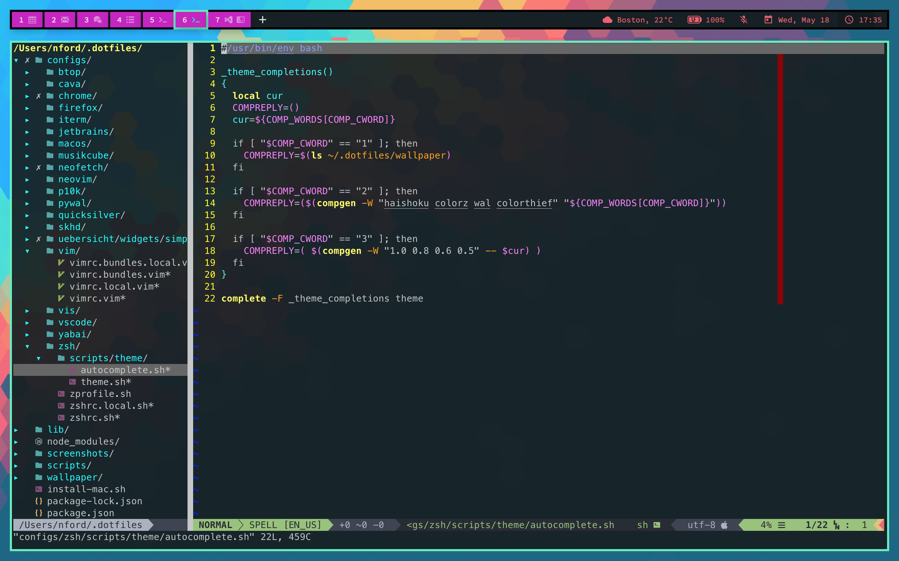
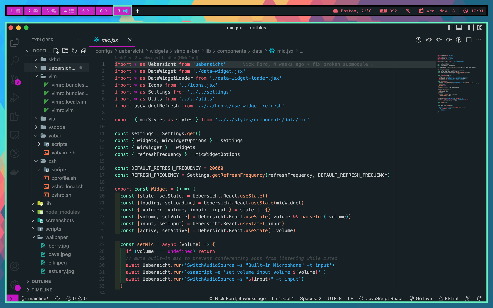

# dotfiles

[](https://opensource.org/licenses/MIT)

My dotfiles for zsh, vim, vscode, etc

## Screenshots





## Setup

Running the setup script does the following:

1. Install homebrew & homebrew packages
1. Install nvm, node, and npm
1. Install node dependencies
1. Symlink dotfiles
1. Source `~/.zshrc`

Before symlinking the dotfiles, you will be prompted to pick which ones to install, and if there are existing dotfiles there you'll be prompted to overwrite or skip.

To run the setup script locally:

```bash
# clone the repo
git clone https://github.com/nickforddev/dotfiles && cd dotfiles

# run the install script
./install.sh
```

## Untracked configs

If a setting is device-specific or sensitive, it should be added to a `.untracked` config. For instance, if `~/.zshrc.untracked` exists, it will be automatically sourced, but not tracked by git.

## Homebrew

Installs the following:

- homebrew
- zsh
- oh-my-zsh
- powerlevel10k
- git-lfs
- vim
- node
- npm
- nvm
- cask-fonts

## Fonts

- hack
- roboto
- open-sans
- inconsolata
- source-code-pro
- source-code-pro-for-powerline
- material-icons

## ZSH

With [Powerlevel10k](https://github.com/romkatv/powerlevel10k) theme and a bunch of oh-my-zsh plugins

### Plugins

| Package                                                                                          | Description         |
|--------------------------------------------------------------------------------------------------|---------------------|
| **zsh plugins**                                                                                  |                     |
| [oh-my-zsh](https://github.com/robbyrussell/oh-my-zsh)                                           | _zsh framework_     |
| [powerlevel10k](https://github.com/romkatv/powerlevel10k)                                        | _zsh theme_         |
| [zsh-autosuggestions](https://github.com/zsh-users/zsh-autosuggestions)                          | _autocompletion_    |
| **oh-my-zsh plugins**                                                                            |                     |
| [osx](https://github.com/robbyrussell/oh-my-zsh/blob/master/plugins/osx/README.md)               | _osx plugin_        |
| [sudo](https://github.com/robbyrussell/oh-my-zsh/blob/master/plugins/sudo/README.md)             | _sudo plugin_       |
| [brew](https://github.com/robbyrussell/oh-my-zsh/blob/master/plugins/brew/README.md)             | _homebrew plugin_   |
| [git](https://github.com/robbyrussell/oh-my-zsh/blob/master/plugins/git/README.md)               | _git plugin_        |
| [github](https://github.com/robbyrussell/oh-my-zsh/blob/master/plugins/github/README.md)         | _github plugin_     |
| [docker](https://github.com/robbyrussell/oh-my-zsh/blob/master/plugins/docker/README.md)         | _docker plugin_     |
| [virtualenv](https://github.com/robbyrussell/oh-my-zsh/blob/master/plugins/virtualenv/README.md) | _virtualenv plugin_ |
| [npm](https://github.com/robbyrussell/oh-my-zsh/blob/master/plugins/npm/README.md)               | _npm plugin_        |
| [node](https://github.com/robbyrussell/oh-my-zsh/blob/master/plugins/node/README.md)             | _node plugin_       |
| [pip](https://github.com/robbyrussell/oh-my-zsh/blob/master/plugins/pip/README.md)               | _pip plugin_        |
| [python](https://github.com/robbyrussell/oh-my-zsh/blob/master/plugins/python/README.md)         | _python plugin_     |
| [jsontools](https://github.com/robbyrussell/oh-my-zsh/blob/master/plugins/jsontools/README.md)   | _json tools plugin_ |

## Vim

Opinionated Vim config using Vundle as a package manager

### Vim bundles

| Package                                                                                       | Description                           |
|-----------------------------------------------------------------------------------------------|---------------------------------------|
| **Essentials**                                                                                |                                       |
| [VundleVim/Vundle.vim](https://github.com/VundleVim/Vundle.vim)                               | _package manager_                     |
| [scrooloose/nerdtree](https://github.com/scrooloose/nerdtree)                                 | _filesystem browser_                  |
| [jistr/vim-nerdtree-tabs](https://github.com/jistr/vim-nerdtree-tabs)                         | _nerdtree tabs_                       |
| [bling/vim-airline.git](https://github.com/bling/vim-airline.git)                             | _vim airline support_                 |
| [vim-airline/vim-airline-themes](https://github.com/vim-airline/vim-airline-themes)           | _vim airline themes_                  |
| [w0rp/ale](https://github.com/w0rp/ale)                                                       | _linter_                              |
| **Utilities**                                                                                 |                                       |
| [kien/ctrlp.vim](https://github.com/kien/ctrlp.vim)                                           | _fuzzy finder for files, buffer, etc_ |
| [mileszs/ack.vim](https://github.com/mileszs/ack.vim)                                         | _ack support_                         |
| [airblade/vim-gitgutter](https://github.com/airblade/vim-gitgutter)                           | _git diff in the gutter_              |
| [tpope/vim-fugitive](https://github.com/tpope/vim-fugitive)                                   | _git integration_                     |
| [SirVer/ultisnips](https://github.com/SirVer/ultisnips)                                       | _snippets_                            |
| [Valloric/YouCompleteMe](https://github.com/Valloric/YouCompleteMe)                           | _autocompletion_                      |
| [mattn/emmet-vim](https://github.com/mattn/emmet-vim)                                         | _emmet support_                       |
| [majutsushi/tagbar](https://github.com/majutsushi/tagbar)                                     | _class outline viewer_                |
| **Editing**                                                                                   |                                       |
| [tpope/vim-commentary](https://github.com/tpope/vim-commentary)                               | _comment handling_                    |
| [Raimondi/delimitMate](https://github.com/Raimondi/delimitMate)                               | _delimit quotes, braces, etc_         |
| [tpope/vim-surround](https://github.com/tpope/vim-surround)                                   | _wrap text_                           |
| [tpope/vim-sleuth](https://github.com/tpope/vim-sleuth)                                       | _use tabwidth of current file_        |
| [godlygeek/tabular](https://github.com/godlygeek/tabular)                                     | _tab alignment tools_                 |
| [terryma/vim-expand-region](https://github.com/terryma/vim-expand-region)                     | _selection expansion/reduction_       |
| [kristijanhusak/vim-multiple-cursors](https://github.com/kristijanhusak/vim-multiple-cursors) | _allow for multiple cursors_          |
| **Buffers**                                                                                   |                                       |
| [blueyed/ZoomWin](https://github.com/blueyed/ZoomWin)                                         | _zoom in and out of tabbed buffers_   |
| [sjl/vitality.vim](https://github.com/sjl/vitality.vim)                                       | _iterm / tmux support_                |
| **Themes**                                                                                    |                                       |
| [jordwalke/flatlandia](https://github.com/jordwalke/flatlandia)                               | _flatlandia_                          |
| [morhetz/gruvbox](https://github.com/morhetz/gruvbox)                                         | _gruvbox_                             |
| [joshdick/onedark.vim](https://github.com/joshdick/onedark.vim)                               | _one dark_                            |
| **Syntax**                                                                                    |                                       |
| [klen/python-mode](https://github.com/klen/python-mode)                                       | _python_                              |
| [vim-ruby/vim-ruby](https://github.com/vim-ruby/vim-ruby)                                     | _ruby_                                |
| [plasticboy/vim-markdown](https://github.com/plasticboy/vim-markdown)                         | _markdown_                            |
| [othree/html5.vim](https://github.com/othree/html5.vim)                                       | _html5_                               |
| [hail2u/vim-css3-syntax](https://github.com/hail2u/vim-css3-syntax)                           | _css3_                                |
| [groenewege/vim-less](https://github.com/groenewege/vim-less)                                 | _less_                                |
| [isRuslan/vim-es6](https://github.com/isRuslan/vim-es6)                                       | _es6 (javascript)_                    |
| [posva/vim-vue](https://github.com/posva/vim-vue)                                             | _vue_                                 |

## VSCode

Various preferred settings

## Quicksilver

Various preferred triggers

## MacOS

Various preferred settings
